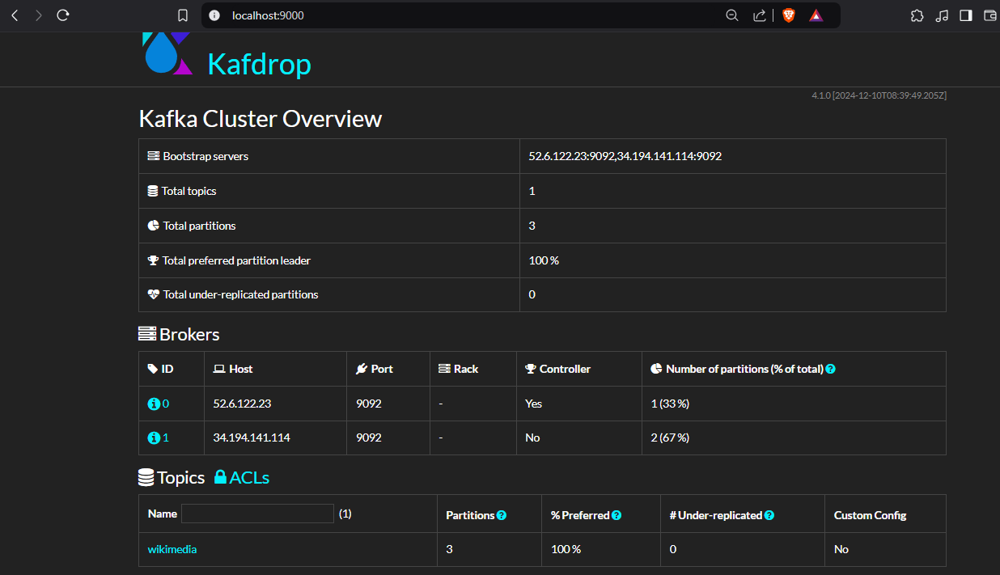
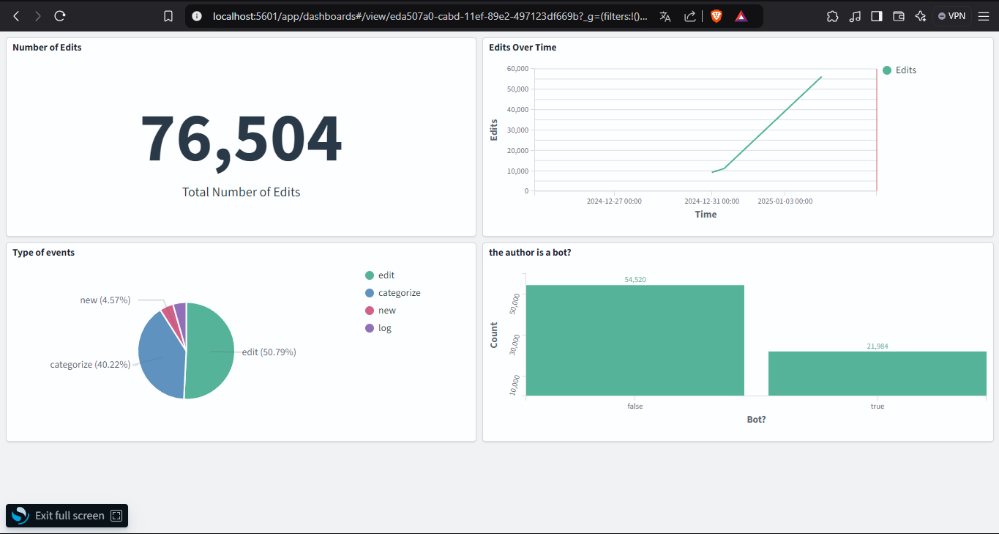
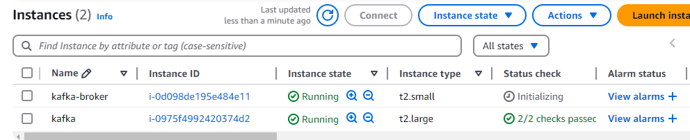

# Kafka and OpenSearch Setup

## Prérequis

- Python 3
- Kafka
- Docker
- OpenSearch

## Configuration de l'environnement

1. Créer un environnement virtuel Python et l'activer :

    ```bash
    python3 -m venv kafka-env
    source kafka-env/bin/activate
    ```

2. Installer les dépendances à partir du fichier `requirements.txt` :

    ```bash
    pip install -r requirements.txt
    ```

## Démarrer Zookeeper et Kafka

2. Démarrer Zookeeper :

    ```bash
    cd kafka && bin/zookeeper-server-start.sh config/zookeeper.properties
    ```

3. Démarrer le broker Kafka :

    ```bash
    cd kafka && bin/kafka-server-start.sh config/server.properties
    ```

4. Créer un topic Kafka :

    ```bash
    bin/kafka-topics.sh --create --topic wikimedia --bootstrap-server 52.6.122.23:9092,34.194.141.114:9092 --partitions 3 --replication-factor 2
    ```

## Interface utilisateur Kafka

5. Démarrer l'interface utilisateur Kafka avec Docker :

    ```bash
    sudo docker-compose up -d
    ```

6. Accéder à l'interface utilisateur à l'adresse suivante : [http://localhost:9000/](http://localhost:9000/)



## Exécution des scripts

7. Exécuter les scripts `producer.py` et `consumer.py` :

    ```bash
    cd kafka_labs
    python3 producer.py
    python3 consumer.py
    ```

## Configuration d'OpenSearch

8. Suivre les instructions pour installer OpenSearch sur Ubuntu 20.04 : [Guide d'installation OpenSearch](https://green.cloud/docs/how-to-install-opensearch-on-ubuntu-20-04/)

9. Remplacer la commande d'installation par :

    ```bash
    sudo env OPENSEARCH_INITIAL_ADMIN_PASSWORD=<custom-admin-password> apt install opensearch
    ```

10. Configurer le service OpenSearch pour démarrer automatiquement avec systemd :

    ```bash
    sudo systemctl daemon-reload
    sudo systemctl enable opensearch.service
    ```

11. Démarrer le service OpenSearch :

    ```bash
    sudo systemctl start opensearch.service
    ```

12. Vérifier la connexion à OpenSearch :

    ```bash
    curl -X GET https://localhost:9200 -u 'admin:<custom-admin-password>' --insecure
    ```

## Dashboard

Voici une capture d'écran de notre dashboard :



## Instances AWS

Voici une capture d'écran de nos instances AWS :



## Liens utiles

- [Wikimedia EventSource Demo](https://esjewett.github.io/wm-eventsource-demo/)
- [CodePen Example](https://codepen.io/Krinkle/pen/BwEKgW?editors=1010)